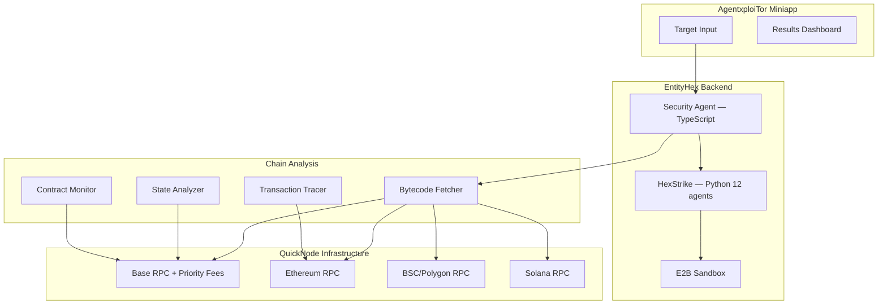

# QuickNode Integration Specification — AgentxploiTor

## Goal
Replace dependency on Basescan/Etherscan API (rate-limited, third-party) for contract source fetching with direct QuickNode RPC access. Extend contract analysis to support live on-chain data verification. Enable multi-chain expansion (Ethereum, BSC, Polygon, Solana) from a single QuickNode Build plan.

## Consciousness Gate 1 Validation
✅ **Alignment Passed:** AgentxploiTor provides independent security verification — users depend on it for capital-at-risk decisions. Rate-limited third-party APIs (Basescan) create single points of failure that could block audits during high demand. QuickNode RPC gives reliable, direct chain access. Glass Box principle demands that the analysis pipeline uses transparent, auditable on-chain data — not opaque API dependencies.

## Context

AgentxploiTor's entityhex spec defines the contract resolution flow:

```
Current (Basescan API):
Contract address → Basescan API → verified source
                 → (unverified) → bytecode via Basescan
                 → (Solana) → program account via public RPC

With QuickNode:
Contract address → QuickNode RPC → eth_getCode (bytecode)
                 → Basescan API → verified source (still used for verification)
                 → QuickNode RPC → eth_getStorageAt (state analysis)
                 → QuickNode RPC → debug_traceTransaction (exploit reconstruction)
```

QuickNode doesn't replace Basescan entirely — Basescan provides verified source code (ABI, source mapping). But QuickNode provides **reliable, rate-unlimited bytecode + state + trace access** that Basescan cannot match.

## Architecture



## Phased Implementation

### Phase 1: Base Chain + Bytecode Fetching (Groups 1-2)
Replace Basescan API as primary bytecode source. Reliable, rate-unlimited.

### Phase 2: State Analysis + Transaction Tracing (Groups 3-4)
On-chain state inspection and exploit path reconstruction.

### Phase 3: Multi-Chain Expansion (Group 5)
Ethereum, BSC, Polygon support via QuickNode's multi-chain endpoints.

### Phase 4: Solana Integration (Group 6)
Solana program analysis using QuickNode Solana RPC.

## Specific Requirements

### 1. Bytecode Fetching (Replaces Basescan API Dependency)
- **Req 1.1:** QuickNode `eth_getCode` for contract bytecode retrieval (replaces Basescan rate-limited API).
- **Req 1.2:** Fall back to Basescan API only for verified source code (ABI, source mapping) — QuickNode for bytecode, Basescan for source.
- **Req 1.3:** Cache bytecode in E2B sandbox or local store to avoid re-fetching during analysis.

### 2. State Analysis (New Capability)
- **Req 2.1:** `eth_getStorageAt` to inspect contract state — admin roles, pauser flags, upgrade proxy slots.
- **Req 2.2:** Feed state analysis into HexStrike's VulnerabilityCorrelator for enriched findings.
- **Req 2.3:** Detect proxy patterns (EIP-1967, UUPS, Transparent) by reading implementation slot.

### 3. Transaction Tracing (New Capability)
- **Req 3.1:** `debug_traceTransaction` or `trace_transaction` to reconstruct exploit execution paths.
- **Req 3.2:** Feed trace data into AIExploitGenerator for PoC exploit validation.
- **Req 3.3:** Only for post-mortem analysis of known exploits (not live scanning).

### 4. Contract Monitoring (Phase 2 Foundation)
- **Req 4.1:** QuickNode `eth_subscribe` for new blocks monitoring contracts under surveillance.
- **Req 4.2:** Detect bytecode changes (proxy upgrades, admin transfers) via block-by-block comparison.
- **Req 4.3:** Trigger re-audit when contract state changes detected.

### 5. Multi-Chain Expansion
- **Req 5.1:** Ethereum mainnet RPC for contract verification on Ethereum.
- **Req 5.2:** BSC/Polygon RPC for multi-chain audits.
- **Req 5.3:** Chain auto-detection in TargetInputForm routes to correct QuickNode endpoint.

### 6. Solana Integration (Phase 4)
- **Req 6.1:** Solana RPC for `getAccountInfo` — fetch deployed program accounts.
- **Req 6.2:** Feed Solana program data into HexStrike's SolanaAnalyzerAdapter (currently regex-only, add live chain data).
- **Req 6.3:** Verify Solana program upgrade authority via on-chain account data.

---

## Task Groups

### Group 1: QuickNode Setup + Base Chain Bytecode
- [ ] 1.1 Enable QuickNode Build plan — create Base mainnet endpoint
- [ ] 1.2 Create `src/blockchain/quicknode_client.ts` — EVM RPC wrapper using `viem` (already in project for payment verification)
- [ ] 1.3 Implement `getBytecode(address, chain)` — call `eth_getCode` via QuickNode
- [ ] 1.4 Update contract resolution flow in `miniapp/src/lib/chain-resolver.ts`:
  - Primary: QuickNode `eth_getCode` for bytecode
  - Secondary: Basescan API for verified source (ABI)
  - Tertiary: E2B Mythril bytecode analysis if no source
- [ ] 1.5 Add `QUICKNODE_BASE_URL` and `QUICKNODE_API_KEY` to `.env.example`

### Group 2: State Analysis
- [ ] 2.1 Implement `getStorageSlot(address, slot, chain)` — call `eth_getStorageAt` via QuickNode
- [ ] 2.2 Implement proxy detection — read EIP-1967 implementation slot (`0x360894a13ba1a3210667c828492db98dca3e2076cc3735a920a3ca505d382bbc`)
- [ ] 2.3 Detect admin/owner roles — read `Ownable.owner()` slot or `AccessControl` role slots
- [ ] 2.4 Create `miniapp/src/lib/state-analyzer.ts` — state analysis utility (<400 lines)
- [ ] 2.5 Feed state findings into HexStrike VulnerabilityCorrelator as additional context

### Group 3: Transaction Tracing
- [ ] 3.1 Implement `traceTransaction(txHash, chain)` — call `debug_traceTransaction` via QuickNode
- [ ] 3.2 Parse trace output into call tree for exploit path visualization
- [ ] 3.3 Feed trace data into AIExploitGenerator for PoC validation
- [ ] 3.4 Create `miniapp/src/lib/transaction-tracer.ts` — trace utility (<400 lines)

### Group 4: Contract Monitoring (Phase 2 Foundation)
- [ ] 4.1 Implement `subscribeToBlocks(chain)` — QuickNode `eth_subscribe` for new blocks
- [ ] 4.2 Monitor watched contracts for bytecode changes between blocks
- [ ] 4.3 Detect admin role transfers, proxy upgrades, pause state changes
- [ ] 4.4 Store monitoring state in persistent storage (Vercel KV/Redis — Group 5 of entityhex spec)

### Group 5: Multi-Chain Expansion
- [ ] 5.1 Enable QuickNode endpoints: Ethereum mainnet, BSC, Polygon
- [ ] 5.2 Update `quicknode_client.ts` with multi-chain routing
- [ ] 5.3 Update chain auto-detection in TargetInputForm to route to correct endpoint
- [ ] 5.4 Test contract analysis on Ethereum, BSC, Polygon contracts

### Group 6: Solana Integration
- [ ] 6.1 Enable QuickNode Solana endpoint
- [ ] 6.2 Implement `getSolanaProgram(programId)` — call `getAccountInfo` via QuickNode Solana RPC
- [ ] 6.3 Extend HexStrike SolanaAnalyzerAdapter with live chain data (currently regex-only)
- [ ] 6.4 Verify program upgrade authority via on-chain account data
- [ ] 6.5 Update target input to accept Solana program addresses (base58 detection)

---

## Endpoint Allocation

| Endpoint | Chain | Purpose | AgentxploiTor Uses |
|---|---|---|---|
| `entityhex-base-main` | Base | Bytecode, state, traces | Phase 1 (now) |
| `entityhex-eth-main` | Ethereum | Multi-chain audits | Phase 3 |
| `entityhex-bsc-main` | BSC | Multi-chain audits | Phase 3 |
| `entityhex-poly-main` | Polygon | Multi-chain audits | Phase 3 |
| `entityhex-solana-main` | Solana | Program analysis | Phase 4 |

Shared with RepuLayer children (`repulayer-solana-main`, `repulayer-solana-dev`) from the 10-endpoint Build plan.

## Iteration Estimates

| Group | Iterations | Notes |
|---|---|---|
| Group 1: QuickNode Setup + Bytecode | 2 | Replace Basescan API dependency |
| Group 2: State Analysis | 2 | New capability — proxy + admin detection |
| Group 3: Transaction Tracing | 2 | New capability — exploit reconstruction |
| Group 4: Contract Monitoring | 2 | Phase 2 foundation |
| Group 5: Multi-Chain | 1 | Endpoint routing |
| Group 6: Solana | 2 | Program analysis extension |
| **Total** | **~11** | **~7 parallelized** |

## Cost

QuickNode Build plan — included in existing yearly subscription. No additional cost.

---

*Last updated: 2026-03-21*
